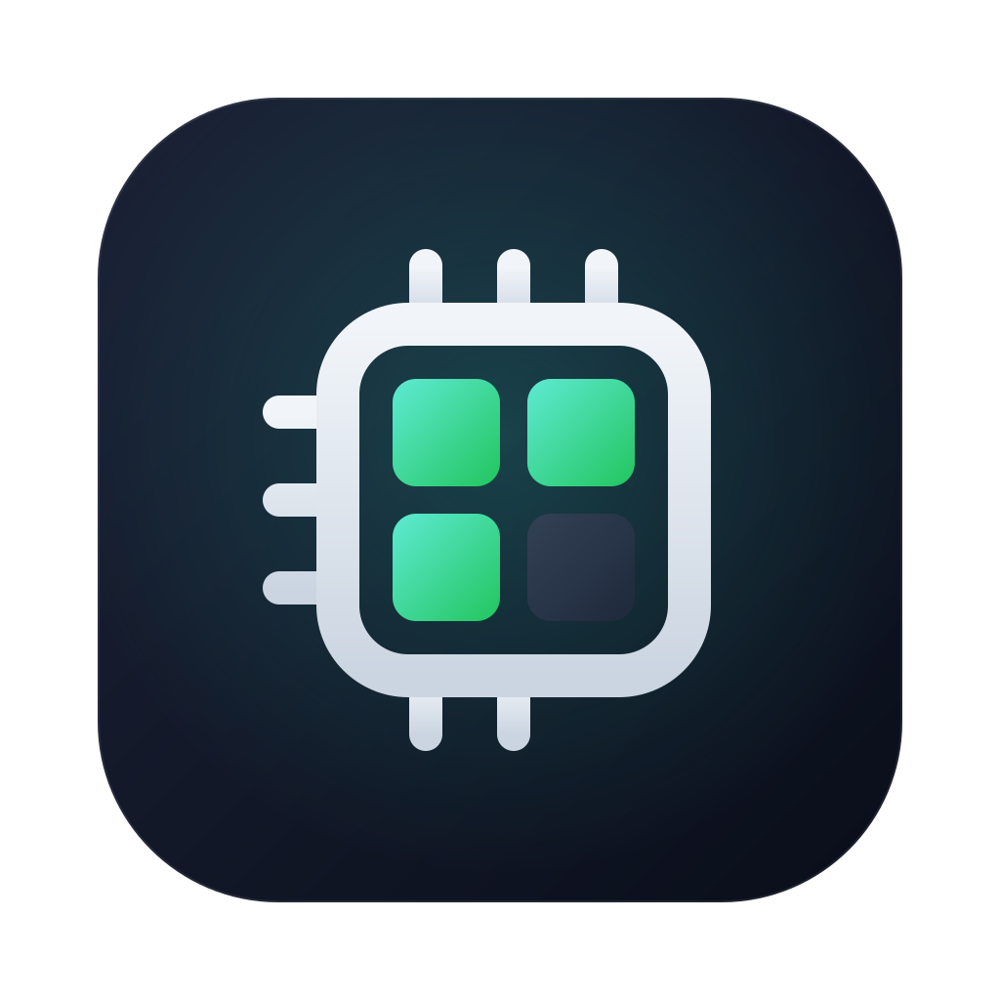
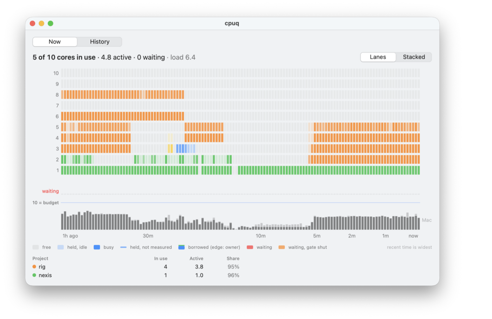

  

<h1 align="center">cpuq</h1>

  A machine-wide jobserver for builds, tests, benchmarks and coding agents, on macOS and Linux.

cpuq is a CPU core queue: heavy jobs started from many shells, sessions and
agents wait their turn for a number of cores out of a shared budget, then run
in the foreground holding them. One binary, no daemon: every hold is a
`flock(2)` on a file in a state directory, so the kernel releases it when its
holder dies, however it dies.

## Why a queue, and not self-tuning

A job can know how many cores it can use: a test binary is single-threaded,
a compile runs in parallel. It cannot know how many it should use, because
that depends on everything else the machine is running, and no single
process sees that.

- **Each job tuning itself to the CPU** means each assumes it owns every
  core. Alone, that is right. With several sessions and agents each starting
  `-j10` builds and test runs on a 10-CPU machine, it is 30 or more threads
  on 10 CPUs, a load of 50 to 100, and every job crawling.
- **Each job tuning itself to the current load** (`make -l`, checking the
  load average) races. Every job checks at the same moment, sees an idle
  machine and starts, and the load average lags by a minute, so they pile in
  together.

cpuq is the shared piece no process can be on its own:

- **One count for the whole machine.** Cores are handed out atomically
  across every shell, session and agent, so two jobs never both take the
  same free capacity.
- **A queue:** who goes next, with priorities, aging and ETAs, plus
  backfill and lending, so free or idle cores do not sit unused while
  others wait.
- **Quiet windows:** `--exclusive` gives a benchmark the machine to itself,
  and a named lease does the same for another machine (`--host`).
- **A shared view and a record:** what runs, what waits, what is held but
  idle (`cpuq status`, Cpuq.app), and the history that shows each kind of
  job's real use.
- **Safety valves** on load and memory pressure.

On one 10-CPU Mac shared by three agent sessions, this took the load average
from 36 to 120 down to 5 to 9, with most jobs starting at once.

A job still says roughly how many cores it can use (`--cores 1` for a
single-threaded run, `--cores 2-4` for a build), as every scheduler asks for
a request. That is a property of the job, not a guess about everyone else,
and a range lets cpuq size the grant to what is free.

cpuq earns its keep when independent jobs share a machine: several shells,
sessions, agents or CI runners. One person running one job at a time gains
little from it.

## Install

macOS and Linux, arm64 and x86-64:

    curl -fsSL https://raw.githubusercontent.com/shreeve/cpuq/main/install.sh | bash

or with Homebrew (macOS or Linux):

    brew install shreeve/tap/cpuq

`install.sh` downloads the latest release for this machine, checks it
against the release's sha256 checksums and installs `cpuq` to
`~/.local/bin`, or to `/usr/local/bin` when run as root (`BIN=DIR` picks
another). `| bash -s v0.1.0` pins a version and `| bash -s -- --uninstall`
removes it. The queue is per user, so on a shared machine one copy on
everyone's `PATH` is enough: `curl … | sudo bash`. The Linux binaries are
static and run on any distribution.

From source, with Zig 0.17.0:

    zig build install -Doptimize=safe -p ~/.local

`zig build` writes `bin/cpuq` in the checkout; `zig build test` runs the unit
tests and `test/run.sh` the end-to-end tests against `bin/cpuq`. Releasing is
described in [docs/RELEASING.md](docs/RELEASING.md).

## Usage

    cpuq run [--cores K|MIN-MAX] [--priority high|normal|low] [--exclusive] [--label TEXT]
             [--max-wait SECONDS] [--no-load-check] [--qos none] -- CMD ARGS...
    cpuq lease NAME [--slots N] [--host HOST] [--priority P] [--label TEXT] [--max-wait SECONDS] -- CMD ARGS...
    cpuq lease NAME --host HOST --hold [--priority P] [--label TEXT] [--max-wait SECONDS]
    cpuq wait --label PATTERN [--max-wait SECONDS]
    cpuq status [--host HOST]... [--json] [--no-usage] [--watch[=SECONDS]]
    cpuq history [--label PATTERN] [--limit N] [--json]
    cpuq budget
    cpuq qos

`cpuq run` waits its turn, then runs CMD in the foreground: stdin, stdout and
stderr are inherited (a terminal stays a terminal), signals are forwarded and
the exit status passes through (a command killed by signal N kills cpuq with
the same signal, so the shell sees 128+N and a `^C` stops a shell loop).
`--cores K` asks for exactly K cores; `--cores MIN-MAX` starts as soon as MIN
are free and takes up to MAX of what is free then, which suits any tool that
takes a job count (`zig build -j`, `make`, test runners) and keeps cores from
idling while jobs wait. The default is 2, and a request is clamped to the
budget. `--exclusive` takes the whole
budget: it waits at the head of the queue for running work to drain, with
nothing going ahead of it, and blocks everything behind it while it runs. While queued, cpuq prints a line
to stderr about once a minute (who it waits behind), and `--max-wait` gives
up with status 75; `--max-wait 0` takes what is free now or gives up at once.

CMD gets `CPUQ_CORES` (the cores it was granted), `CPUQ_TOKEN` (its lease)
and a GNU make jobserver sized to the grant.
`CPUQ_CORES` is advisory: tools use every core unless told otherwise, so pass
it on: `zig build -j$CPUQ_CORES`, `cargo build -j$CPUQ_CORES`, `ninja
-j$CPUQ_CORES`. For make, run plain `make`: it takes its job slots from the
jobserver in MAKEFLAGS (below). `zig build -jN` limits the build runner to N
concurrent steps; it has no jobserver client and does not pass `-j` on to the
compiler processes it starts.

A `cpuq run` inside a running one (a valid `CPUQ_TOKEN` in its environment)
starts at once within its parent's grant and passes everything through
untouched (it execs CMD). If the token's lease is no longer held, the
variable is ignored and the run queues normally.

`cpuq budget` prints the budget in force; `cpuq qos` prints the calling
process's scheduling class.

### Watching the machine

`cpuq status` shows the budget, the cores in use (handed out to jobs) and
free, the load, memory pressure and the admission gate, then every job
holding cores (label, cores in use, cores active, priority, how long, pid,
command), every waiter (order, cores asked for, priority, how long, ETA,
command) and the named leases. On a terminal it draws boxed tables, with the
gate and memory in green, yellow or red and a job keeping fewer than half its
cores active in yellow (it asks for too much), plus the cores in use per
project (the label up to its first `:`);
`NO_COLOR` keeps the boxes and drops the color. Anywhere else it prints plain
text. `--watch` redraws it in place every 2 seconds (`--watch=N`: every N)
until `^C`.

Cores active is the CPU time a command's whole process tree spends over half
a second, the short-lived processes it starts and reaps included. The same
sample rates every other process: when work outside cpuq adds up to a core or
more, or the gate is closed, status names the busiest such processes, so the
cause of a load spike shows at once. `--no-usage` skips the half second for a
script that only needs the counts. A waiter's ETA plays the queue forward
with each label's typical run time from the history (its project's when the
label is new); `?` means nothing ahead of it has a history yet. A holder
marked `*` is a lease whose cpuq is gone while its command still runs.

`--host HOST` shows HOST's status instead, fetched over ssh and drawn here;
`--host` repeats, and `--host local` is this machine, so
`cpuq status --host local --host pup` is one view of both.

`cpuq status --json` gives the same for programs: a `schema` number (1; it
changes only when a field is removed or changes meaning), the `version`, the
gate as `{"state", "load", "text", "trip", "reopen", "busy_trip"}` with `state` one of
open, pressure, load or spacing and, while the load check is on, the valve's thresholds (it
trips above `trip` while the CPUs are at least `busy_trip` busy, and reopens at `reopen`),
each holder's `cores`, `slots` (which of the budget's cores it holds, by
number, 0 up) and `using`, each waiter's `cores`, `max`
and `eta`, the named `leases` with their `holders` and `waiters`, and
`outside`, the busiest processes outside cpuq. With several `--host`s it is
one object keyed by host.

### The menu-bar app (macOS)

[`app/`](app/) holds Cpuq.app, a menu-bar companion: the chip in the menu
bar fills a cell per quarter of the budget in use, its menu shows what runs
(cores in use and active), what waits (with ETAs), the leases and any load
outside cpuq, and Show Graphs charts the last hour and the history. It only
reads `cpuq status --json` and `cpuq history --json`. Install it with
`brew install --cask shreeve/tap/cpuq-app`; it updates itself through
Sparkle.

  

Each lane is one of the budget's cores: empty while free, pale while a job
holds it but leaves it idle, solid while busy. Here two projects use 95% of
what they reserved and nobody waits. Under the lanes, a red row counts who
waits, and a strip shows the Mac's CPUs busy, cpuq's jobs and everything else.

### History

Every job is recorded as it queues, starts and ends, in
`~/.local/state/cpuq/history.jsonl` (`$XDG_STATE_HOME/cpuq`; beside the state
directory when `CPUQ_DIR` is set; `CPUQ_HISTORY` names the file), outside
`/tmp` so it outlives a reboot. `cpuq history` lists jobs newest first: label,
pool (cores or a lease), cores in use, how long each waited and ran, the
cores it kept active on average (its CPU time, from the kernel, over its run
time), and
how it ended: an exit status, a signal, `gave up` (`--max-wait`, `cpuq
cancel`, or a hangup, ^C or kill while it waited) or `lost`, a job that
never finished because its cpuq died uncaught (SIGKILL, a crash) or the
machine restarted. A `--hold` lease killed while held ends by that signal. A summary follows: the median and longest wait, and the cores
active of the cores in use on average, which says how to size `--cores`.
`--label` filters (`rig:*` for a prefix), `--limit` sets how many (20), and
`--json` gives the jobs to a program. A program that waits without
`--max-wait` and without a terminal (an agent's tool call) is told once that
its own timeout may end the wait first.

### Right-sizing

A grant is fixed for the whole run, so a range request that takes everything
free up to its maximum wastes cores whenever the job uses fewer. cpuq caps a
range near what jobs with the same label have used: once a label has three
finished runs in the history, `--cores MIN-MAX` takes at most the 75th
percentile of their average active cores plus 0.3, rounded, never below MIN.
A test run that keeps 0.8 of a core busy and asks for `1-4` gets 1; a build
that uses 3.5 keeps `1-4`. It says so when it caps. A fixed `--cores K` is
never changed; `right_size = off` turns it off. A job with phases of
different width (a parallel compile, then a single-threaded test) is best
run as one cpuq job per phase, each sized for its phase.

### A hand at the queue

    cpuq first  LABEL|PID     move a waiting job to the front
    cpuq start  LABEL|PID     start a waiting job now, past the queue, the budget and the gates
    cpuq cancel LABEL|PID     take a waiting job out of the queue (it exits 75)
    cpuq pause  LABEL|PID     stop a running job's whole process tree (SIGSTOP)
    cpuq resume LABEL|PID     continue it (SIGCONT)
    cpuq stop   LABEL|PID     end a running job (SIGTERM to its whole process tree)

LABEL may end in `*` for a prefix; a target that matches several jobs needs
`--all`. A waiting job takes its order at its next look: the head within
`poll`, the next waiters within 2 seconds. `start` never goes into an
`--exclusive` run, and nothing here touches one: those are timing windows.
A job started by hand is marked `"forced": true` in its history; a paused job
shows as paused in `cpuq status --json`, and its cores are lent at once. A
paused job keeps its memory and its cores' reservation, and a network peer
may time out on it, so pause suits builds and tests best.

### Quiet windows

A benchmark that needs the machine to itself runs under `--exclusive`: it
waits for running work to drain, nothing else is admitted while it runs, and
the window ends when it exits, however it exits. Its own builds and helpers
run inside it as nested runs. A window that spans several commands wraps
them in one: `cpuq run --exclusive --label bench -- ./bench.sh`, or an
interactive `cpuq run --exclusive -- $SHELL`. cpuq has no separate hold
command: a hold not tied to a running process would need a file that outlives
its owner, which is the thing cpuq exists to avoid.

A named lease can carry a quiet window too: `cpuq lease NAME --exclusive`
takes NAME, then the machine's whole budget once running work drains, and
keeps both until it ends. Nothing else is admitted meanwhile; the lease's own
command runs its `cpuq run`s inside the window. With `--host HOST --hold` the
window is on HOST: a script that drives timing work over ssh holds HOST's
cores for as long as it holds the lease, and other work on HOST fills the
machine between such holders.

### Named leases

`cpuq lease NAME -- CMD` runs CMD holding NAME, a first-come, first-served
lock on anything that is not cores: a benchmark machine, a database, one
build per cache. It is the same queue as cores, with one holder at a time,
or N with `--slots N` (a database that takes three connections, a machine
that takes two builds); callers of one lease pass the same N. Priorities,
aging, `--label`, `--max-wait` and `cpuq status` work as for `cpuq run`, and
the kernel frees the lease however its holder ends. A lease
gates nothing on the machine's load and leaves the command's cores,
jobserver and scheduling class alone. A name is letters, digits, `.`, `_`
and `-`.

CMD gets `CPUQ_LEASES`, the leases it runs inside, so a `cpuq lease` of the
same name within it starts at once: scripts that each take a lease can call
one another.

`--host HOST` holds the lease on HOST's cpuq and runs CMD here: cpuq starts
`ssh HOST cpuq lease NAME --hold`, waits for HOST to grant the lease, runs
CMD, then closes the connection, which gives the lease back. If cpuq is
killed or the connection drops, the far side's cpuq dies with its session and
HOST's kernel frees the lease, so a crashed pipeline never strands it. A
script on one machine that drives work on another (`ssh` to it, step by
step) and work started on that machine itself then share one queue:

    cpuq lease pup-bench --host pup --label gate -- ./gate.sh

HOST needs cpuq on the `PATH` of a non-interactive ssh command, and the ssh
login must not ask for a password. A run inside a `--host` lease that calls
`cpuq lease NAME --host HOST` again starts at once; to let a command on HOST
see the lease as its own, pass `CPUQ_LEASES` through ssh.

A script that takes the lease partway through its run, and gives it back
later, uses `--hold` with `--host` and no command. Once HOST grants the
lease, cpuq prints `held NAME@HOST ENTRY`, where ENTRY is the `CPUQ_LEASES`
entry (`NAME@HOST=ID:PID`) that makes runs inside see the lease as theirs,
and holds it until its stdin closes or it dies. In any bash, 3.2 included:

    d=$(mktemp -d); mkfifo "$d/in" "$d/out"
    cpuq lease pup-bench --host pup --hold <"$d/in" >"$d/out" & hold=$!
    exec 8>"$d/in"
    read -r word name entry <"$d/out"; rm -rf "$d"
    export CPUQ_LEASES="$entry${CPUQ_LEASES:+ $CPUQ_LEASES}"
    ...                                   # every step on pup, one lease
    exec 8>&-; wait $hold                 # give it back (or just exit)

Inside a hold of the same lease, `--hold` prints the entry already held and
holds nothing, so a script can take the lease without knowing whether its
caller already has.

`cpuq wait --label PATTERN` returns once no job whose label matches holds or
waits for cores or a lease (`PATTERN*` matches a prefix), so a script can
wait for another session's work without polling `cpuq status`;
`--max-wait` gives up with 75.

### Environment

| variable | meaning |
|---|---|
| `CPUQ_DIR` | the state directory (an absolute path) |
| `CPUQ_BUDGET` | the budget in cores, over the config file |
| `CPUQ_CONFIG` | the config file, default `~/.config/cpuq/config` |
| `CPUQ_CORES` | set for CMD: the cores it holds |
| `CPUQ_TOKEN` | set for CMD: its lease, which makes runs inside it nested |
| `CPUQ_LEASES` | set for CMD: the named leases it runs inside, `NAME=ID` here and `NAME@HOST=ID:PID` on HOST |
| `CPUQ_HISTORY` | the history file |

### Budget and configuration

The budget is the cores cpuq hands out: `CPUQ_BUDGET`, else `budget` in the
config file, else the active core count minus 2 (8 on a 10-core Mac), leaving
a reserve for the owner's own work. It is capped by the cores active now;
with `active_cap = off` it is not, and a budget above the machine's core
count oversubscribes it on purpose. The config file is `CPUQ_CONFIG`, default
`~/.config/cpuq/config`, with `key = value` lines (`#` comments):

| key | default | meaning |
|---|---|---|
| `budget` | active cores - 2 | cores to hand out |
| `active_cap` | on | cap the budget by the cores active now |
| `load_check` | on | the load safety valve (below) |
| `load_margin` | 4 | the valve trips above budget + margin |
| `pressure_check` | on | admit nothing under memory pressure |
| `pressure_psi` | 10 | Linux: `some avg10` percentage that counts as pressure |
| `qos` | on | map priorities to scheduling classes |
| `aging` | 600 | seconds of waiting per one-class promotion; 0 turns it off |
| `poll` | 0.5 | seconds between the head's re-checks |
| `note` | 60 | seconds between "waiting" lines |
| `backfill` | on | let a waiter start ahead of the head on cores the head cannot use yet |
| `patience` | 30 | the least seconds the head lets others go ahead without run times to judge by |
| `lend` | on | lend the head the cores a running job leaves idle |
| `lend_after` | 60 | seconds a core must stay idle before it is lent |
| `right_size` | on | cap a range request near what its label has used |
| `max_memory` | off | stop a job whose processes together use more memory than this (e.g. `16G`) |

With `max_memory` set, each running job's cpuq looks every 2 seconds at the
memory its command and the command's descendants use (macOS's physical
footprint, compressed pages included, as Activity Monitor shows it; Linux's
resident set). Over the limit, it asks the whole tree to stop (SIGTERM),
makes it (SIGKILL) 10 seconds later if any of it remains, says so, and
records the job as stopped for its memory (`memory` in `history --json`,
"memory 42.0G" in `cpuq history`). One job that balloons, a compiler or a
test caught in a loop that allocates, would otherwise fill the swap and shut
the memory gate on everyone.

An invalid line is an error naming the file and line. A run already
waiting re-reads the file when it changes, so a new budget applies at once;
an invalid edit keeps the settings in force and says so.

### Priority and scheduling class

Waiters are served high before normal before low, in arrival order within a
class. A waiter is promoted one class per `aging` seconds of waiting, so low
is never starved. The command also runs in a scheduling class: on macOS,
high leaves it unchanged, normal runs it at utility QoS and low at background
QoS (on Apple Silicon background work stays on the efficiency cores, with
throttled I/O), set with `posix_spawnattr_set_qos_class_np`; on Linux, nice 0,
5 and 15. Children inherit it. `--exclusive` runs (they time benchmarks) and
`--qos none` never change it.

### The machine gates

The head of the queue admits nothing while:

- the OS reports memory pressure: macOS `kern.memorystatus_vm_pressure_level`
  at 2 (warn) or more; Linux `/proc/pressure/memory` `some avg10` at
  `pressure_psi` or more, when the file exists (`pressure_check = off`);
- the load safety valve is closed (`load_check = off`, or `--no-load-check`
  per run). The budget is what schedules work; the valve is a safety net. It
  reads the machine's whole 1-minute load, cpuq's own jobs included, so it
  catches load from outside cpuq and jobs that use more cores than they were
  granted (a `zig build` whose compiler processes ignore `-j`) alike. It
  trips when the load exceeds budget + `load_margin` and the CPUs are
  measured at least 90% busy (the load average counts threads and lags a
  minute, so a high load with CPUs to spare does not trip it), reopens as
  soon as the CPUs fall below 75% busy, or once the load has stayed at or
  under budget + `load_margin`/2 (10 for a budget of 8) for 15 seconds, and while the load is above the budget it admits at most one
  job per 10 seconds, so waiters never stampede into a lagging load average.
  A tripped valve nobody has checked for over a minute reopens at once when
  the load is at or under that level, since the 1-minute average already
  covers that calm.

The budget is capped by the cores active now (macOS `hw.activecpu`, Linux the
process's CPU affinity). On Apple Silicon `hw.activecpu` does not appear to
drop under thermal throttling, so this cap is a safeguard, not a thermal
signal.

### GNU make jobserver

CMD gets a jobserver: a pipe holding K-1 tokens whose descriptors it
inherits, and MAKEFLAGS with ` -j --jobserver-auth=R,W --jobserver-fds=R,W`,
the form GNU make hands its own sub-makes (make 4.2 and later read
`--jobserver-auth`, macOS's /usr/bin/make 3.81 reads `--jobserver-fds`).
Existing MAKEFLAGS flags are kept; their `-j` and jobserver options are
replaced. So `make` under `cpuq run --cores 3` runs at most 3 recipes at
once, with GNU make 3.81 and 4.4 alike, and so does `make -j` with 3.81.
GNU make 4.x lets a `-j` on its own command line override any jobserver (it
warns "-jN forced in submake"): `make -jN` then runs N at once, and a bare
`make -j` is unlimited. A nested run leaves MAKEFLAGS as it is.

## Design

**State directory.** `CPUQ_DIR`, else `/tmp/cpuq-UID` with `/tmp` resolved
(`/private/tmp` on macOS), a literal path so that every session agrees on it
whatever its `TMPDIR`. If it cannot be created or written, cpuq fails; it
never falls back to another directory.

    admission.lock      the admission lock
    seq                 the last ticket number
    valve               the load valve's state
    queue/P-NNNNNNNNNN  one ticket per waiter (P: 0 high, 1 normal, 2 low)
    tokens/NNNN         one file per core of the machine
    leases/NNNNNNNNNN   one record per running job (.x: exclusive)

Only `flock(2)` is used, never fcntl locks: an flock belongs to the open file
description, survives fork and exec, and is not dropped when some other
descriptor of the file closes.

**The queue.** A waiter creates its ticket under a temporary name, locks it
exclusively, writes its record and renames it into place, all under the
admission lock, and holds that lock while it waits. Waiters are ordered by
class (priority after aging), then ticket number. A waiter that is not at
the head blocks on the ticket just ahead of it (a blocking shared flock
that returns when that waiter is admitted or dies), so a long queue costs
nothing. The head polls every `poll` seconds: under the admission lock it reads the
gates and, if they are open, tries to take its k tokens, all of them or none
(on failure it releases what it took). The first eight waiters behind it
also look every 2 seconds whether backfill lets them start (below); the
rest only block. Every grant is all or nothing under the admission lock, so
two waiters can never each hold part of what they need.

**Fairness and backfill.** The queue is in order, but cores the head cannot
use yet need not sit idle. A waiter behind it may start at once, taking what
is free up to its maximum, when its minimum fits, nobody ahead of it may go
first (the head if it fits, or an earlier waiter backfill would also let
go), and either:

- history knows both run times, and the waiter's typical run ends before
  the head is expected to start, so the head loses nothing; or
- history cannot say, and the head has waited less than its patience: half
  its own typical run, from `patience` seconds (30) to 5 minutes. After
  that, nothing goes ahead, and cores that free up are kept for the head.

A wrong estimate delays the head by at most one job's overrun, and patience
bounds how long others may go ahead, so the head never starves. Nothing goes
ahead of an `--exclusive` head (it waits for the machine to drain), and
named leases stay strictly in order. A job that went ahead says so on stderr
and is marked `"ahead": true` in its history. `backfill = off` restores
strict order. A head waiting for an exact count while fewer cores are free
says once that a range would start it now.

**Lending.** A job that holds cores it does not use keeps others waiting
for nothing, so the head of the queue measures what each running job's
command tree actually uses, averaged over half of `lend_after` seconds.
Cores a job has left wholly idle for `lend_after` (60) are lent to the
head on top of the budget: a job holding 3 cores and keeping 1 busy for a
minute lends 1 (a quarter of a core is kept as slack). Only idle cores are
lent, so the work running stays within the budget. Nothing is taken from the lender. If it gets busy again, the
machine runs over the budget until someone finishes, and the load valve
stops further admissions meanwhile. A job started on lent cores says so,
and its history marks how many (`"lent": N`). Nothing is lent to an
exclusive run or a named lease; `lend = off` turns it off. Lending goes only
into CPUs the machine has to spare, judged by the load and by the CPUs'
measured busy share, so it never pushes the load past the CPU count. A job
started on lent cores runs at background priority (macOS QoS background,
Linux nice 15), so a lender that gets busy again has its CPUs back at once.
A job paused by hand (`cpuq pause`) lends all its cores at once.

Once the head's minimum fits,
the head takes up to its maximum of the free cores, but leaves the next
waiter's minimum free when it can still get its own, so a wide request does
not stall the job behind it. `--exclusive` takes the whole budget at the
head (and nothing is admitted while an exclusive lease is alive). Lowering
the budget below what is held only stops admissions.

**Holds.** A job's tokens and its lease are exclusively flocked, and the
command inherits those descriptors (they are not close-on-exec; every other
descriptor is). If cpuq itself is SIGKILLed, the command and its children
keep the cores until they exit; `cpuq status` shows such a lease with its
holder gone. When the command exits, cpuq unlocks every token (`LOCK_UN`
releases the lock for every process sharing the descriptor) before closing
it, so a descendant that kept a descriptor (a build server, a `nohup`'d
helper) does not keep the cores.

**Dead files.** Any file whose lock can be taken has no holder. Probes take a
shared lock, and only under the admission lock, so a probe never makes a
free token look busy to the head; a dead ticket or lease found this way is
removed (after checking that the path still names the probed inode). Token
files are never removed. Nothing depends on pids: they are recorded for
`cpuq status` only.

**Kill and reboot.** A SIGKILLed waiter's ticket lock is released by the
kernel: the waiter behind it wakes at once, and the dead ticket is removed
by the next scan. A SIGKILLed job (cpuq and its command) releases its tokens
the moment the last process holding them exits. A reboot releases
everything; the leftover files are dead and are cleaned as they are found.

**Signals.** While the command runs, cpuq forwards HUP, INT, QUIT, TERM, USR1
and USR2 that a process sends it (`kill -INT <cpuq>` reaches the command).
A signal from the terminal driver (`^C`, `^\`, hangup) has no sending pid
(`si_pid` 0); the terminal already sent it to the whole foreground process
group, the command included, so cpuq does not send it again (as with
`system(3)`). A process that signals the whole process group (`kill -INT
-PGID`) has a pid, so the command receives such a signal twice.

## Limits

- Cooperative only: cpuq holds cores by convention. Work that does not run
  under cpuq is seen only through the load valve, and a job uses as many
  cores as its tools take; `CPUQ_CORES` and the jobserver are how a job
  keeps to its grant.
- `zig build` has no jobserver client; pass `-j$CPUQ_CORES`. A `-j` on GNU
  make 4.x's command line overrides the jobserver.
- A descendant that outlives a SIGKILLed cpuq keeps the cores until it exits.
- One machine: the state directory must be on a local file system with
  working `flock(2)`.
- One queue per user: the state directory is `/tmp/cpuq-UID`, so two users
  on one machine each have their own budget.
- One queue per `/tmp`: a container has its own `/tmp`, and with it its own
  queue. Containers share the host's queue only through a common `CPUQ_DIR`
  on a bind mount.
