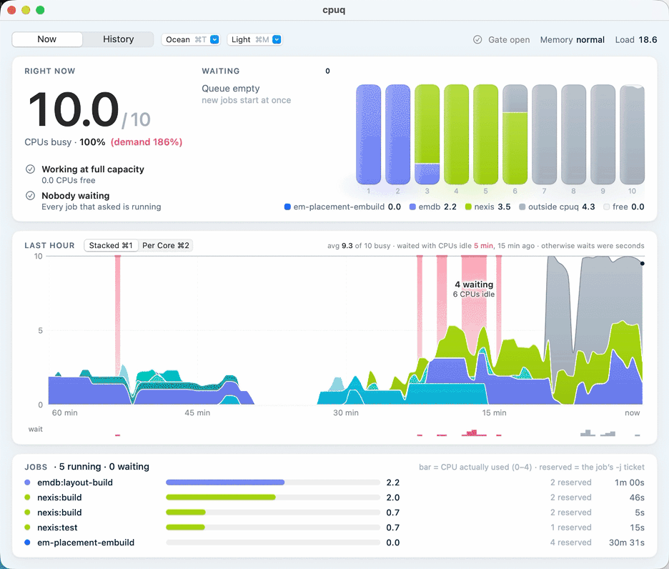

  

<h1 align="center">cpuq</h1>

  A machine-wide jobserver for builds, tests, benchmarks and coding agents, on macOS and Linux.

cpuq is a CPU queue. Heavy commands started from many shells, sessions and agents wait their
turn for room on the CPUs, then run in the foreground. One binary, no daemon: every hold is a
`flock(2)` on a file, so the kernel releases it however its holder dies.

The queue is per user. "Machine-wide" means across every process that user runs on the machine;
another user on the same machine has a queue of their own.

  
   Cpuq.app, the menu-bar companion (see <a href="#cpuqapp-macos">Cpuq.app</a>)

## Quick start

    curl -fsSL https://raw.githubusercontent.com/shreeve/cpuq/main/install.sh | bash

    cpuq run --label app:test --cores 1 -- ./run-tests
    cpuq run --label app:build --cores 2-6 -- sh -c 'zig build -j"$CPUQ_CORES"'
    cpuq status

The first runs a single-threaded test suite once there is room. The second asks for 2 to 6
cores, gets as many as there is room for, and passes the count to the build: cpuq sets
`$CPUQ_CORES` for the command, so it must be expanded inside `sh -c '…'`, in single quotes, not
by the shell you type in. The third shows what runs and what waits.

Agents: read [AGENTS.md](AGENTS.md).

### Install

`install.sh` downloads the latest release for macOS or Linux (arm64 or x86-64), checks it
against the release's sha256 checksums and installs `cpuq` to `~/.local/bin`, or to
`/usr/local/bin` as root (`BIN=DIR` picks another). `| bash -s v0.1.0` pins a version and
`| bash -s -- --uninstall` removes it. On a machine with several users, one copy on everyone's
`PATH` is enough: `curl … | sudo bash`. The Linux binaries are static.

With Homebrew: `brew install shreeve/tap/cpuq`. From source, with Zig 0.17.0:
`zig build install -Doptimize=safe -p ~/.local`. In a checkout, `zig build` writes `bin/cpuq`,
`zig build test` runs the unit tests and `test/run.sh` the end-to-end tests against `bin/cpuq`.

## Why

A job knows how many CPUs it can use: a test binary is single-threaded, a compile runs in
parallel. It cannot know how many it should use, because that depends on everything else the
machine runs, and no single process sees that.

- **Each job tuning itself to the CPU count** assumes it owns every CPU. With several sessions
  and agents each starting `-j10` builds on a 10-CPU machine, that is 30 or more threads on 10
  CPUs, and every job crawls.
- **Each job tuning itself to the load** (`make -l`) races: every job checks at the same moment,
  sees an idle machine and starts, and the load average lags by a minute.

cpuq is the shared piece: one count for the machine, taken atomically, with a queue, priorities
and estimates, a view of what runs, and a history of what each kind of job really used. On one
10-CPU Mac shared by three agent sessions, it took the load average from 36-120 down to 5-9,
with most jobs starting at once. It earns its keep when independent jobs share a machine; one
person running one job at a time gains little from it.

**Hasn't someone solved this already?** Pieces of it, many times over: global make jobservers,
job spoolers, Google's Borg, Meta's Buck2, benchmark locks, and in 2026 a wave of build locks for
AI agents. [docs/PRIOR-ART.md](docs/PRIOR-ART.md) surveys them all: what each does, what cpuq
borrows, and what is new here.

## Words

| word | meaning |
|---|---|
| CPU | a logical processor, as the OS counts them |
| job | one `cpuq run` (or `cpuq lease`) and the command it runs |
| waiter | a job still in the queue |
| `--cores` request | how many CPUs a job's tools may keep busy: `K`, or a range `MIN-MAX`; what it gets is its *grant*, in `$CPUQ_CORES` |
| label | a job's name, `project:task`; history is kept by label |
| measured use | the CPU a job's whole process tree gets, in CPUs (2.0: two CPUs busy) |
| target | how many CPUs of measured use cpuq fills; by default every active CPU |
| gate | a machine check that holds the whole queue: memory pressure, low memory, the load valve |
| exclusive run | a job that has the machine to itself, for timing |
| named lease | a queue for something that is not CPUs: a database, a device, another machine |

## How jobs are admitted

cpuq admits jobs by measured use (`admit = measured`, the default). The first waiter starts when
its expected use fits under `target` beside what the running jobs use. A running job counts at
its expected use for its first 20 seconds (`settle`), then at what it is measured using. So a job
that holds 4 cores and sleeps leaves the room to others within seconds, and a build that keeps 6
CPUs busy counts as 6, whatever it asked for.

A job's expected use is the 75th percentile of its label's recent runs, once there are three;
until then, its whole grant. A waiter behind the first starts at once when it fits too and
leaves the first its room (or the first has waited less than `patience`). A grant never changes
once its job starts.

The older model, admission by the cores each job holds out of a fixed budget, is still there:
see [Reservation mode](#reservation-mode-admit--cores).

## Using it

    cpuq run [--cores K|MIN-MAX] [--label PROJECT:TASK] [--priority high|normal|low]
             [--max-wait SECONDS] [--exclusive] [--opaque] [--no-load-check] [--qos none|auto]
             -- CMD ARGS...

`cpuq run` waits its turn, then runs CMD in the foreground: stdin, stdout and stderr are
inherited (a terminal stays a terminal), signals are forwarded, and CMD's exit status is cpuq's.
While it waits it prints a line to stderr about once a minute, saying who it waits behind.

CMD's environment gets `CPUQ_CORES` (its grant), a GNU make jobserver of that size in
`MAKEFLAGS`, and `CPUQ_TOKEN` (its hold, which makes runs inside it nested).

**Work cpuq can't see.** cpuq measures a job by its command's process tree. Work that runs in a
container or a VM (`incus exec`, `docker exec`) belongs to the container's own processes, so the
job measures idle and its cores would be handed out again. Give such a job `--opaque` and a
`--cores` count: it counts at its whole grant the whole time, is never started inside a lending
timing window (it couldn't be frozen), and `cpuq pause`/`stop` say they reach only the command
cpuq started.

**CPU weights (Linux).** With `cpu_weights = on`, each job runs in a systemd user scope of its
own whose CPU weight is its grant (`systemd-run --user --scope`). On a crowded machine CPU time
then divides in proportion to grants, so a job that starts more threads than it was granted
(`zig build` without `-j`) slows only itself; on a quiet one a job can still use every CPU.
Where `systemd-run --user` doesn't work, jobs run as they are. Work in a container stays in the
container's own cgroup.

### How many cores

- `--cores K` asks for exactly K. Use `--cores 1` for single-threaded work.
- `--cores MIN-MAX` starts with MIN once there is room, and takes up to MAX of the room there
  is. Once the label has three finished runs, MAX is capped near what it used (its 75th
  percentile plus 0.3, rounded, never below MIN). This suits any tool that takes a job count.
- Without `--cores`, the label's history decides: from 1 up to its 75th percentile plus 0.3,
  rounded, at most half the machine's CPUs, as room allows. A label with fewer than three
  finished runs, or no label, gets 2.

A request can be at most four times `target`. Under `admit = cores` a request is clamped to the
budget, a job without `--cores` gets 2, and only `right_size` caps a range. Size a job by what
its tools can use, not by the machine: `cpuq history` shows each job's active cores.

### Passing the grant on

Most tools use every CPU unless told otherwise, so pass `$CPUQ_CORES` on. cpuq sets it in CMD's
environment, not in the shell you type in: in `cpuq run -- make -j$CPUQ_CORES` your shell
expands `$CPUQ_CORES` before cpuq runs, to nothing, and `make -j` with no number has no limit.
Wrap the command in `sh -c` with single quotes, so the inner shell expands it after cpuq has
set it:

| tool | after `cpuq run --label … --cores 2-6 --` |
|---|---|
| make | `make` (no `-j`: make takes its job slots from the jobserver in `MAKEFLAGS`) |
| zig | `sh -c 'zig build -j"$CPUQ_CORES"'` |
| cargo | `sh -c 'cargo build -j "$CPUQ_CORES"'` |
| ninja | `sh -c 'ninja -j "$CPUQ_CORES"'` |
| swift | `sh -c 'swift build -j "$CPUQ_CORES"'` |
| go | `sh -c 'go build -p "$CPUQ_CORES" ./...'` |
| pytest-xdist | `sh -c 'pytest -n "$CPUQ_CORES"'` |

A bare `zig build` uses every CPU. `zig build -jN` limits the build runner to N concurrent steps;
it has no jobserver client and does not pass `-j` to the compiler processes it starts, so a step
can still use more. GNU make 4.x lets a `-j` on its own command line override the jobserver.

### Labels

Give every job a label, `project:task`, lowercase and the same on every run: `app:build`,
`app:test`, `site:deploy`. History sizes jobs, sets their expected use and estimates waits by
label, so a label with a run id, date or branch name in it never has a history. `cpuq status`
sums the cores in use by project, the label up to its first `:`, and a new label's wait estimate
uses its project's.

### One job per phase

A grant is fixed for the whole run. A script that compiles in parallel and then runs
single-threaded tests is best run as one job per phase, each sized for its phase:

    cpuq run --label app:build --cores 2-6 -- make
    cpuq run --label app:test --cores 1 -- ./run-tests

### Nested runs

A `cpuq run` inside a running job (a `CPUQ_TOKEN` in its environment whose hold is alive) starts
at once and runs CMD unchanged: its `--cores` and other options are ignored, and `CPUQ_CORES`
and `MAKEFLAGS` stay the parent's. So a script run under cpuq may call others that use cpuq. A
token whose hold has ended is ignored, and the run queues as usual.

## Watching

### cpuq status

    cpuq status [--host HOST]... [--json] [--no-usage] [--watch[=SECONDS]]

`cpuq status` shows the cores handed out, the load, memory pressure and the gate; every running
job (label, cores in use, cores active, priority, how long, pid, command); every waiter (order,
cores asked for, priority, how long, ETA, command); and the named leases. On a terminal it draws
boxed tables in color (`NO_COLOR` drops the color): a job keeping fewer than half its cores
active shows in yellow, since it asks for too much. Anywhere else it prints plain text, with a
line `admit   by measured use, up to N CPUs`. A running job marked `*` is one whose cpuq is
gone while its command still runs. When work outside cpuq uses a CPU or more, or a gate is
closed, status names the busiest such processes.

- `--json` is for programs (below). `--watch` redraws on a terminal every 2 seconds
  (`--watch=N`: every N) until `^C`; it refuses to run without a terminal or with `--json`.
- `--no-usage` skips the half-second sample of what each job uses.
- `--host HOST` shows HOST's status, fetched over ssh; it repeats, and `--host local` is this
  machine, so `cpuq status --host local --host buildbox` is one view of both.

`cpuq status --json` is one object (with several `--host`s, one per host, keyed by host). Its
`schema` (1) changes only when a field is removed or changes meaning; new fields may appear.

| field | meaning |
|---|---|
| `version`, `dir` | cpuq's version and the state directory |
| `admit`, `target` | `measured` or `cores`; the target in CPUs (null under `cores`) |
| `budget`, `held`, `free` | the budget, and the cores handed out and left of it |
| `cores`, `active_cores` | the machine's CPUs, and those active now |
| `load`, `memory_pressure` | the 1-, 5- and 15-minute load; `normal`, `high`, `unknown` or `off` |
| `gate` | `state` (`open`, `pressure`, `low_memory`, `load` or `spacing`), `load`, `text`, and the valve's `trip`, `reopen` and `busy_trip` |
| `holders[]` | running jobs: `pid` (its cpuq), `holder_alive`, `child` (the command), `cores`, `slots`, `using` (cores active), `paused`, `priority`, `exclusive`, `label`, `command`, `since`, `ticket` |
| `waiters[]` | in order: `order` (1 first), `cores` and `max` (the request), `priority`, `class` (after aging), `eta` (seconds; null when unknown), `exclusive`, `pid`, `label`, `command`, `since`, `ticket` |
| `leases[]` | named leases held or waited for: `name`, `holders`, `waiters` |
| `outside[]` | the busiest processes outside cpuq: `pid`, `name`, `using` |

A waiter's ETA plays the queue forward with each label's typical run time from history; it is
unknown while anything ahead of it has no history.

### cpuq history

    cpuq history [--label PATTERN] [--limit N] [--json]

Every job is recorded as it queues, starts and ends, in `~/.local/state/cpuq/history.jsonl`
(`$XDG_STATE_HOME/cpuq/` when set; beside the state directory when `CPUQ_DIR` is set;
`CPUQ_HISTORY` names the file outright). `cpuq history` lists the last 20 jobs (`--limit N`),
newest first: label, pool (`cores` or a lease's name), cores in use, how long each waited and
ran, its active cores (its CPU time over its run time), its peak memory, and how it ended: an exit
status, `signal N`, `memory 42.0G` (stopped by `max_memory`), `gave up` (`--max-wait`,
`cpuq cancel`, or killed while it waited), or `lost` (its cpuq died uncaught, or the machine
restarted). A summary follows: the median and longest wait, and active cores against cores in
use on average, which says how to size `--cores`. `--label` filters (`app:*` for a prefix), and
`--json` gives the jobs to a program.

### Cpuq.app (macOS)

[`app/`](app/) holds Cpuq.app, a menu-bar companion. Its chip fills a cell per quarter of the
budget handed out; its menu shows what runs, what waits and the named leases, with Pause,
Resume, Stop, Move to Front, Start Now and Cancel. Show Graphs opens a window with a Now tab (the
CPUs busy right now, each project's share, who waits and why, and the last hour, Stacked by
project (⌘1) or Per Core (⌘2), one lane per CPU, rose where jobs waited beside idle CPUs) and a
History tab (`cpuq history` summed by project). Seven themes, each light and dark, switch with
⌘T and ⌘M. It only reads `cpuq status --json` and `cpuq history --json`. Install it with
`brew install --cask shreeve/tap/cpuq-app`.

## Waiting and order

Waiters are served high before normal before low (`--priority`), in arrival order within a
class. A waiter moves up one class per `aging` seconds (600) of waiting, so low is never starved.
Behind the first waiter, others start as soon as they fit (see
[How jobs are admitted](#how-jobs-are-admitted)).

`--max-wait SECONDS` gives up after that long, with exit status 75; the command never ran. With
`--max-wait 0`, the first waiter takes the room there is now or gives up; any other waiter gives
up at once. A run with no `--max-wait` and no terminal (an agent's tool call, a script) is told
once that its caller's own timeout may end the wait first.

The gates hold the whole queue while they are closed:

- **memory pressure** (`pressure_check`): macOS's critical level; on Linux, `some avg10` in
  `/proc/pressure/memory` at `pressure_psi` (10) or more;
- **low memory** (`min_available`, off by default): available memory under that size;
- **the load valve** (`load_check`): the 1-minute load over the budget plus `load_margin` while
  the CPUs are at least 90% busy. Under measured admission it gates only exclusive runs, though
  `cpuq status` shows it either way. `--no-load-check` skips it for one run.

The command also runs in a scheduling class by priority. On macOS, high and normal leave it
unchanged and low runs at background QoS (on Apple silicon, the efficiency cores, with throttled
I/O). On Linux, high, normal and low run at nice 0, 5 and 15. `--qos none` leaves the class
unchanged (`--qos auto`, the default, maps it). Exclusive runs and named leases never change it.
`cpuq qos` prints the calling process's class.

## Exclusive runs

`cpuq run --exclusive` is for timing, nothing else. At its turn it waits until no job holds any
cores, then takes the budget's worth of cores (`CPUQ_CORES`) and admits nothing else until it
exits, however it exits. While it waits at the front, a job behind it may start only when
history says that job ends before the running work does (`backfill`). Its own builds and
helpers run inside it as nested runs. A window that spans several commands wraps them in one:
`cpuq run --exclusive --label app:bench -- ./bench.sh`, or an interactive
`cpuq run --exclusive -- $SHELL`.

Draining a busy machine stops everyone, so a shared machine can refuse: with `exclusive = off`
in its config, `--exclusive` runs as an ordinary job, alongside the others, and says so on
stderr. Timings taken there are not quiet. Time on a machine that allows exclusive runs (a
named lease with `--host HOST --exclusive` asks HOST, whose own config decides). Plain-text
`cpuq status` (not on a terminal) notes `exclusive runs are off here`.

With `window_gap = SECONDS`, for that long after an exclusive run ends the exclusive runs still
waiting go behind the other waiters (`cpuq status` lists them so), so work that queued during
the window gets its turn before the next one empties the machine again.

**Other work beside a window.** cpuq holds back only cpuq's jobs. While a window runs, its cpuq
watches every other process too (system services such as Spotlight or photo analysis, work
started outside cpuq). It warns on stderr when they pass a CPU (`work outside this timing window
is using 2.3 CPUs (mediaanalysisd 1.8, ...): its timings may be noisy`). At the end it says how
much they used if that reached half a CPU. History keeps it as `noise` and `noise_peak` (CPUs,
average and peak). Rerun a window whose noise was high.

**Lending an idle window.** With `window_lend = SECONDS`, a window held with no command of its
own (`cpuq lease NAME --hold --exclusive`, the far end of `--host … --exclusive`) lends the
machine to waiting jobs once its owner has done nothing for that long. The owner's work is this
user's processes that started after the window opened, other than the jobs it lent to (or, with
`CPUQ_WINDOW_OWNER=PID`, that process's tree). Idle means under 0.1 CPU and no process waiting
on a disk. The moment the owner works again (0.2 CPU, or a process waiting on a disk, checked
every second), the lent jobs are frozen (SIGSTOP) until the owner idles that long again or the
window ends; then they continue. The first second or so of the owner's next step can overlap
them, and frozen jobs keep their memory. `cpuq status` notes a lending window and shows frozen
jobs as paused. This suits a dedicated build or benchmark machine where those processes are the
window's work. It needs measured admission.

## Named leases

    cpuq lease NAME [--slots N] [--exclusive] [--priority P] [--label L] [--max-wait S] -- CMD...
    cpuq lease NAME --host HOST [same options] -- CMD ARGS...
    cpuq lease NAME --host HOST --hold [same options]

`cpuq lease NAME -- CMD` runs CMD holding NAME, a first-come, first-served lock on anything that
is not CPUs: a benchmark machine, a database, one build per cache. It is a queue like the CPUs'
one, with one holder at a time, or N with `--slots N` (every caller of one lease passes the same
N). Priorities, aging, `--label`, `--max-wait` and `cpuq status` work as for `cpuq run`, strictly
in order, and the kernel frees the lease however its holder ends. A lease checks no gates and
leaves the command's cores, jobserver and scheduling class alone. A name is letters, digits,
`.`, `_` and `-`. CMD gets `CPUQ_LEASES`, the leases it runs inside, so a `cpuq lease` of the
same name within it starts at once.

`--exclusive` also takes the machine's cores, as an exclusive run does, once NAME is held, and
keeps both until CMD ends; its claim on the cores goes to the front of the queue.

**On another machine.** `--host HOST` holds the lease on HOST's cpuq and runs CMD here: cpuq
starts `ssh HOST cpuq lease NAME --hold`, waits for HOST to grant the lease, runs CMD, then closes
the connection, which gives the lease back. If cpuq dies or the connection drops, HOST's kernel
frees the lease, so a crashed pipeline never strands it. A script here that drives work on HOST
over ssh and work started on HOST itself then share one queue:

    cpuq lease bench --host buildbox --label app:bench -- ./bench-over-ssh.sh

HOST needs cpuq on the `PATH` of a non-interactive ssh command, and an ssh login that does not
ask for a password. A `cpuq lease NAME --host HOST` inside CMD starts at once, and a command on
HOST that carries CMD's `CPUQ_LEASES` sees the lease as its own. With `--exclusive`, HOST's
`cpuq run`s wait for the lease's window unless they carry its `CPUQ_LEASES`; this line, in
CMD's script, runs inside the window at once:

    ssh HOST "cd repo && CPUQ_LEASES='$CPUQ_LEASES' cpuq run --label app:bench -- ./bench"

**Held by a script.** `--hold` with `--host` and no command takes the lease for a script that
holds it partway through its run. Once HOST grants the lease, cpuq prints
`held NAME@HOST ENTRY`, where ENTRY is the `CPUQ_LEASES` entry (`NAME@HOST=ID:PID`) that makes
runs inside see the lease as theirs, and holds it until its stdin closes or it dies. A newline
every 10 seconds down the connection is its heartbeat, so a hold whose connection drops without
closing ends within a minute (`CPUQ_HOLD_QUIET`). In any bash, 3.2 included:

    d=$(mktemp -d); mkfifo "$d/in" "$d/out"
    cpuq lease bench --host buildbox --hold <"$d/in" >"$d/out" & hold=$!
    exec 8>"$d/in"
    read -r word name entry <"$d/out"; rm -rf "$d"
    export CPUQ_LEASES="$entry${CPUQ_LEASES:+ $CPUQ_LEASES}"
    ...                                   # every step on buildbox, one lease
    exec 8>&-; wait $hold                 # give it back (or just exit)

Inside a hold of the same lease, `--hold` prints the entry already held and holds nothing, so a
script can take the lease without knowing whether its caller already has.

**Waiting for others.** `cpuq wait --label PATTERN [--max-wait SECONDS]` returns once no job
whose label matches (`PATTERN*` for a prefix) runs or waits, for cores or a lease, so a script
can wait for another session's work without polling `cpuq status`. `--max-wait` gives up with
75.

## Managing the queue

    cpuq first  LABEL|PID     move a waiting job to the front
    cpuq start  LABEL|PID     start a waiting job now, past the queue and the gates
    cpuq cancel LABEL|PID     take a waiting job out of the queue (it exits 75)
    cpuq pause  LABEL|PID     stop a running job's whole process tree (SIGSTOP)
    cpuq resume LABEL|PID     continue it (SIGCONT)
    cpuq stop   LABEL|PID     end a running job (SIGTERM to its whole process tree)

These act on anyone's jobs in the queue, not only the caller's, so use them on jobs you did not
start only when you mean to. They act on jobs for cores, not on named leases. PID is the job's
cpuq; LABEL may end in `*` for a prefix. A target that matches several jobs needs `--all` (else
exit 2); one that matches nothing exits 125.

A waiter takes its order at its next look: the first eight within 2 seconds, the rest within a
minute. `start` never starts a job into a running exclusive run, and pause, resume and stop leave
an exclusive run alone. A job started by hand is marked `"forced": true` in history. A paused job
counts for nothing (its cores are lent at once under `admit = cores`) and shows `paused` in
`cpuq status --json`; it keeps its memory and its cores, and a network peer may time out on it,
so pausing suits builds and tests best.

## Configuration

The config file is `CPUQ_CONFIG`, default `~/.config/cpuq/config`: `key = value` lines, `#` for
comments. An invalid line is an error naming the file and line (exit 2). A run already waiting
re-reads the file when it changes; an invalid edit keeps the settings in force and says so.

| key | default | meaning |
|---|---|---|
| `admit` | measured | `measured`: by the CPU jobs use; `cores`: by the cores they hold |
| `target` | active CPUs | the CPUs' worth of measured use to fill (measured only) |
| `settle` | 20 | seconds a new job counts at its expected use (measured only) |
| `patience` | 30 | the least seconds the first waiter lets others start ahead of it when they would delay it |
| `aging` | 600 | seconds of waiting per one-class promotion; 0 turns it off |
| `poll` | 0.5 | seconds between the first waiter's looks |
| `note` | 60 | seconds between "waiting" lines |
| `qos` | on | map priorities to scheduling classes |
| `pressure_check` | on | admit nothing under memory pressure |
| `pressure_psi` | 10 | Linux: the `some avg10` percentage that counts as pressure |
| `min_available` | off | admit nothing while available memory is under this (e.g. `6G`) |
| `max_memory` | off | stop a job whose processes together use more memory than this (e.g. `16G`) |
| `exclusive` | on | grant `--exclusive`; off, it runs as an ordinary job |
| `window_gap` | 0 | seconds after an exclusive run ends during which waiting ones go behind other work |
| `cpu_weights` | off | Linux: run each job in a scope weighted by its grant |
| `window_lend` | 0 | seconds a `--hold --exclusive` window's owner idles before it lends the machine (measured only; 0: never) |
| `budget` | active CPUs - 2 | cores an exclusive run takes; under `admit = cores`, the cores to hand out |
| `active_cap` | on | cap the budget by the CPUs active now |
| `load_check` | on | the load valve (under measured admission, for exclusive runs only) and the 97%-busy check; off ignores the machine's load |
| `load_margin` | 4 | the valve trips above budget + margin; as `load_check` |
| `backfill` | on | let a job start ahead of the first waiter when both fit (measured), or on cores the first cannot use yet (`admit = cores`, and behind an exclusive first waiter) |
| `lend` | on | `admit = cores` only: lend the first waiter the cores a running job leaves idle |
| `lend_after` | 60 | `admit = cores` only: seconds a core must stay idle before it is lent |
| `right_size` | on | `admit = cores` only: cap a range near what its label has used (measured admission always does) |

With `max_memory`, a job over the limit is asked to stop (SIGTERM to its whole process tree),
made to 10 seconds later (SIGKILL), and recorded as stopped for its memory. One job that
balloons would otherwise fill the swap and shut the memory gate on everyone.

## Reservation mode (admit = cores)

With `admit = cores`, each job counts at the cores it holds, out of a fixed budget, as cpuq did
before measured admission. The budget is `CPUQ_BUDGET`, else `budget` in the config, else the
active CPUs minus 2 (8 on a 10-CPU Mac), leaving a reserve for the owner's own work; it is
capped by the CPUs active now unless `active_cap = off`, which lets it oversubscribe the machine
on purpose. `cpuq budget` prints it. A request is clamped to the budget.

In this mode a few things keep reserved cores from sitting idle:

- **The first waiter** takes up to its maximum of the free cores but leaves the next waiter's
  minimum free when it can still get its own.
- **Backfill** lets a waiter start ahead of the first on cores the first cannot use yet, when
  history says it ends before the first could start, or while the first has waited less than its
  patience.
- **Lending** gives the first waiter cores that a running job has left idle for `lend_after`
  seconds, on top of the budget, while the CPUs have room to spare.
- **Right-sizing** caps a range near what its label has used.
- **The load valve** holds every admission while the 1-minute load is over budget +
  `load_margin` and the CPUs are at least 90% busy, and spaces admissions while the load is over
  the budget. The budget schedules the work; the valve catches load from outside cpuq and jobs
  that use more CPUs than they were granted.

[docs/DESIGN.md](docs/DESIGN.md) has the exact rules.

## Environment and exit status

| variable | meaning |
|---|---|
| `CPUQ_DIR` | the state directory, an absolute path (default `/tmp/cpuq-UID`) |
| `CPUQ_CONFIG` | the config file (default `~/.config/cpuq/config`) |
| `CPUQ_BUDGET` | the budget in cores, over the config file |
| `CPUQ_HISTORY` | the history file |
| `CPUQ_HOLD_QUIET` | seconds a `--hold` that has had heartbeats waits for the next before it ends (60) |
| `CPUQ_WINDOW_OWNER` | for a `--hold --exclusive` window with `window_lend`: the PID whose process tree is its owner's work |
| `NO_COLOR` | draw `cpuq status` and `cpuq history` without color |
| `CPUQ_CORES` | set for CMD: its grant |
| `CPUQ_TOKEN` | set for CMD: its hold, which makes runs inside it nested |
| `CPUQ_LEASES` | set for CMD: the named leases it runs inside, `NAME=ID` here and `NAME@HOST=ID:PID` on HOST |
| `MAKEFLAGS` | set for CMD: a GNU make jobserver with `CPUQ_CORES` slots; other flags kept |

| status | meaning |
|---|---|
| CMD's own | the command ran; its exit status passes through |
| 128+N | the command was killed by signal N (cpuq dies by the same signal) |
| 75 | gave up waiting (`--max-wait`, `cpuq cancel`, a `--hold` whose holder went away); the command never ran |
| 125 | cpuq itself failed (the state directory, `status --host`, a control target that matches nothing) |
| 126, 127 | the command is not executable, or not found |
| 2 | a usage error or an invalid config file |

`cpuq --version` prints the version.

## Limits

- Cooperative only: cpuq holds cores by convention. Work not run under cpuq is seen only as
  load, and a job uses as many CPUs as its tools take; `CPUQ_CORES` and the jobserver are how a
  job keeps to its grant.
- Per user: the state directory is `/tmp/cpuq-UID`, so two users on one machine each have their
  own queue, and neither sees the other's jobs except as load.
- One machine: the state directory must be on a local file system with working `flock(2)`.
- One queue per `/tmp`: a container has its own `/tmp`, and with it its own queue. Containers
  share the host's queue only through a common `CPUQ_DIR` on a bind mount.
- A descendant that outlives a SIGKILLed cpuq keeps the cores until it exits.

## More

- [AGENTS.md](AGENTS.md): how a coding agent should use cpuq.
- [docs/DESIGN.md](docs/DESIGN.md): how it works inside.
- [docs/PRIOR-ART.md](docs/PRIOR-ART.md): who else has tackled this, and what cpuq borrows or does differently.
- [CHANGELOG.md](CHANGELOG.md): what changed in each version, and why.
- [docs/RELEASING.md](docs/RELEASING.md): cutting a release.
